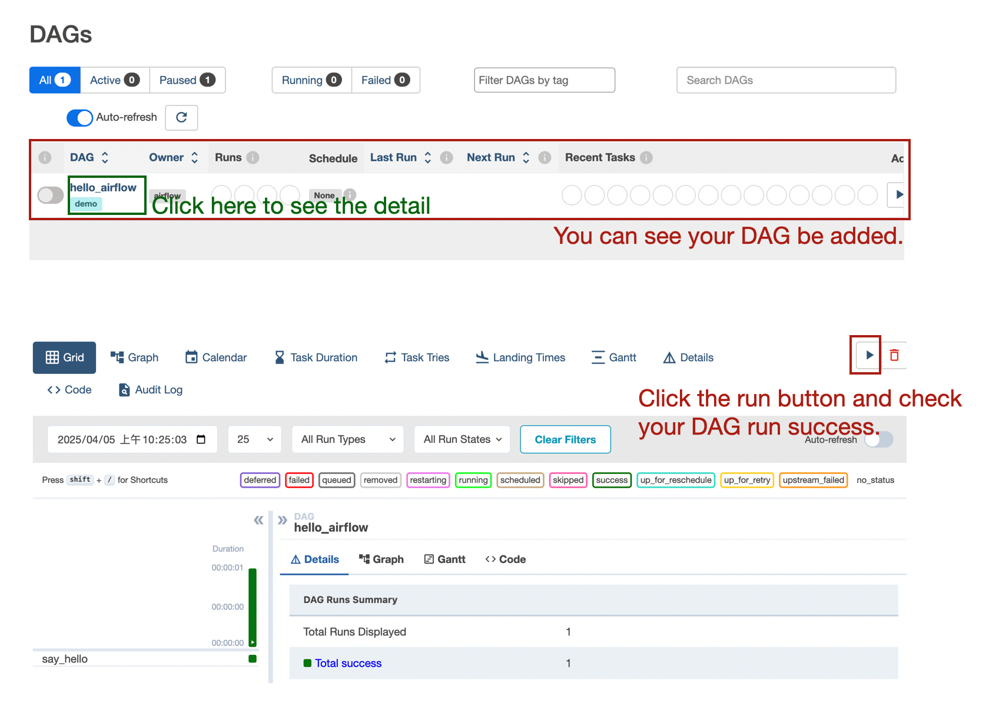
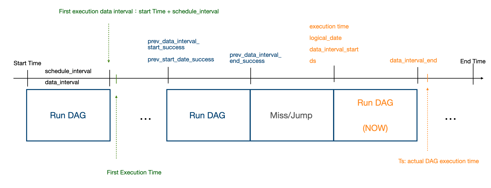

My current work involves using Airflow to build data pipelines, so I set up a local Airflow environment to get a better grasp of the fundamentals. After all, at work we use a pre-configured environment.


I noticed that Airflow has many confusing time parameters, so I created a diagram to distinguish them.Here are more of my notes on Airflow, covering its fundamental operational flow, how to install and configure it, and ultimately how to successfully run a DAG. Check it out here:

https://lisa06010416.github.io/ShareNotes/posts/data-pipeline/airflow/basic-airflow/


## What is Ariflow

Airflow is a Python-based workflow management tool that schedules, executes, and monitors a series of tasks (workflows), automating and reliably handling data processing or other batch operations.


- **DAG (Directed Acyclic Graph)**:  
   The core structure of a workflow. You can think of a DAG as a graph that defines a series of tasks and their relationships (order, dependencies).

   - **Task**:  
      A node within a DAG that represents a specific action, such as running a Python script, calling an API, executing a shell command, or submitting a Spark job. The task has different statuses to indicate its lifecycle—for example **queued**, **running**, **success**, **failed**, or **skipped**.

      

- **Web UI**:  
   A user-friendly visual interface where you can monitor DAG executions, view error logs, rerun tasks, and more.

* **Metadata Database**

​	The database record below important things:

​	**Task Status:** Records where each task is in its lifecycle, whether it has succeeded or failed, and its start and end times.

​	**Task Queue:** The Scheduler posts “what needs to be done next,” Workers read the board to pick up tasks, run them, and then post the results back.

​	**Core Parameters:** Connection details, variables, permissions, and other configuration items are stored in one place for easy reference and updates.


**Scheduler, Executor, and Worker cooperate to orchestrate task execution：**


- **Scheduler**:  
   Scans the DAG and determines which task instances are ready to run.

- **Executor** 

   Pushes those runnable task instances to the appropriate execution backend (local process, Celery queue, Kubernetes API, etc.).

- **Worker** 

   Listen to the queue, completes the tasks, and reports the results back to the metadata database.

   

## Airflow Install

[Installation from PyPI](https://airflow.apache.org/docs/apache-airflow/stable/installation/installing-from-pypi.html). Use follow constrain on terminal to install Airflow.

``````
AIRFLOW_VERSION=2.7.3
PYTHON_VERSION=3.8
CONSTRAINT_URL="https://raw.githubusercontent.com/apache/airflow/constraints-${AIRFLOW_VERSION}/constraints-${PYTHON_VERSION}.txt"

pip install "apache-airflow==${AIRFLOW_VERSION}" --constraint "${CONSTRAINT_URL}"
``````

When install airflow we need to assign constrain and provider. 

**constrain**

- In Airflow installation, a **constraint** is a file that **limits or pins the versions** of packages to ensure compatibility. It helps avoid version conflicts and makes the installation more stable.

**Provider**

In Airflow, a **provider** is a package that adds **extra functionality** for working with specific tools, services, or platforms.

* apache-airflow-providers-google: Add support for Google Cloud (like BigQuery, GCS)
* apache-airflow-providers-postgres: Add support for  PostgreSQL

### Init Airflow

```# initial airflow
export AIRFLOW_HOME=~/airflow
airflow db init
```

After running the init script, you can see the directory structure as follows:

| Path                      | Description                                                  |
| ------------------------- | ------------------------------------------------------------ |
| `airflow/`                | Main Airflow directory                                       |
| ├── `airflow.db`          | Default database (SQLite by default)                         |
| ├── `webserver_config.py` | Configuration file for the Airflow web UI                    |
| ├── `airflow.cfg`         | Main configuration file for Airflow, covering scheduler, webserver, executor, etc. |
| ├── `logs/`               | Directory containing log files generated by Airflow          |
| ├── `dags/`               | Create at following step.  Airflow load DAGs from The default path `~/airflow/dags` |

### Launch Airflow

**Launch Airflow UI**

```
# create a user
airflow users create \
    --username admin \
    --firstname admin\
    --lastname admin \
    --role Admin \
    --email admin@example.com \
    --password admin

# Launcher Web UI
airflow webserver --port 8080
```

Navigate to http://0.0.0.0:8080/ and log in using the credentials admin/admin to access the UI.


**Launcher scheduler**

Open another terminal enter the command ```airflow scheduler```to launch the scheduler

### Run a demo dag on airflow

 Airflow load DAGs from The default path `~/airflow/dags`. Use the following script to add a new DAG. 

```
mkdir -p ~/airflow/dags

cat <<EOF > ~/airflow/dags/hello_airflow.py
from airflow import DAG
from airflow.operators.python import PythonOperator
from datetime import datetime

def hello():
    print("Hello Airflow!")

with DAG(
    dag_id="hello_airflow",
    start_date=datetime(2024, 1, 1),
    schedule_interval=None,
    catchup=False,
    tags=["demo"]
) as dag:
    task = PythonOperator(
        task_id="say_hello",
        python_callable=hello
    )
EOF

```


Navigate to http://0.0.0.0:8080/ and run your DAG. If you **can’t** see your DAG in the web UI, run `airflow dags list-import-errors` or check the DAG import‑error message directly in the web UI.



## Airflow Variable

### How Airflow save Variable

Airflow variables are stored using a key-value format, and by default, they are saved in an SQLite database located at `/Users/{username}/airflow/airflow.db`.

### Set and Get Variable

1. Set directly in the Web UI:  
   Admin > Variables > Click `+`

2. Set using Terminal:

   ```
   airflow variables set my_key1 my_value
   
   airflow variables set -j my_key2 '{"key_in_json": "value_in_json"}'
   ```

3. Set using Python

   * Set

   ```python
   from airflow.models import Variable
   Variable.set(key="key1", value="value1")
   Variable.set(key="key2", value={"key_in_json": "value_in_json"}, serialize_json=True)
   ```

   * Get

   ```python
   from airflow.models import Variable
   var1 = Variable.get("key1")  # Value returned by key1
   json_var2 = Variable.get(
       "key2", deserialize_json=True
   )["key_in_json"]
   print(var1)
   print(json_var2)
   ```

4. Get by **Context**

   * The context is also a dictionary (key-value) data structure
   * It stores variables related to the running DAG and the Airflow environment
   * When using `context` in a function, you can directly access Variables without having to import them with `from airflow.models import Variable`

   ```python
   def print_context_func(**context):
       print(context)
   ```

## Pass parameter between task

### XComs

https://ithelp.ithome.com.tw/articles/10326663

XComs(cross-communications) allows tasks to pass data between each other, but it's designed for small amounts of data. Large datasets should be avoided when using XComs for data transfer.

```
def push_by_xcom(ti):
    ti.xcom_push(key="var1", value="Apple")
    print("Pushed var1='Apple' to XCom")

def pull_by_xcom(ti):
    var1 = ti.xcom_pull(task_ids="push_by_xcom", key="var1")
    print("Pulled var1 from XCom:", var1)
```

## Airflow @dag Setting

```
from airflow.decorators import dag
from datetime import datetime, timedelta

@dag(
    dag_id="my_dag",  # Unique ID of the DAG
    start_date=datetime(2023, 1, 1),  # Start execution time of the DAG
    schedule_interval="@daily",  # Execution schedule
    catchup=False,  # Whether to backfill past runs
    default_args={  # Default parameters for tasks (e.g., owner, retries, etc.)
        "owner": "airflow",
        "retries": 1,
        "retry_delay": timedelta(minutes=5),
    },
    tags=["example"],  # Optional: Used to group or label the DAG
)
def my_dag_function():
    ...

```

### dag_id

`dag_id` is the unique name you specify when defining a DAG in your Python code. This name will also appear in the Airflow web UI.

### Various Time Parameter in Airflow

Airflow executes a DAG **after** the `schedule_interval` has passed since the `start_date`. This means Airflow only starts processing data that occurred **between** `start_date` and `start_date + schedule_interval` **after** the full interval has completed.



Assuming the DAG runs once per day (`schedule_interval = @daily`) and our task is responsible for processing data from the previous day, then for a given run, the time-related variables are as follows:

- `execution_date`: 2024-04-01
- `data_interval_start`: 2024-04-01 00:00
- `data_interval_end`: 2024-04-02 00:00

If this run succeeds, then:

- `prev_data_interval_start_success` = 2024-04-01 00:00
- `prev_data_interval_end_success` = 2024-04-02 00:00


There are the descriptionption for time paramerters in Airflow:

| Time Parameter                           | Description                                                  |
| ---------------------------------------- | ------------------------------------------------------------ |
| `start_date`                             | The **start time** of the DAG or Task. Airflow begins triggering the DAG from this time based on the `schedule_interval`. |
| `end_date`                               | The **end time** of the DAG or Task. After this point, the DAG will no longer be scheduled or executed. |
| `schedule_interval` / `data_interval`    | The scheduling interval of the DAG. It determines how often the DAG runs. <br />Examples: `@once`, `@daily`, `'0 6 * * *'`, `timedelta(hours=2)` |
| `data_interval_start`                    | **Airflow 2.2+** <br /> The **start of the data interval (inclusive)** for the current task run. |
| `data_interval_end`                      | **Airflow 2.2+** <br /> The **end of the data interval (exclusive)** for the current task run. |
| `execution_date` / `logical_date` / `ds` | `execution_date`: Used in **Airflow 1.x**, represents the **logical date** the DAG run is for (not the actual run time).<br />`logical_date`: New term in **Airflow 2.x**, replaces `execution_date` with clearer meaning. |
| `ts`                                     | The actual timestamp when the DAG run is triggered (actual execution time). |
| `prev_data_interval_start_success`       | **Airflow 2.x** <br /> The **start of the data interval** (inclusive) for the **last successful** DAG or Task run. <br />Set automatically by the scheduler based on history. May differ from `execution_date` due to skipped or backfilled runs. Commonly used to determine where to resume processing. |
| `prev_data_interval_end_success`         | The **end of the data interval** (exclusive) for the **last successful** DAG or Task run. |
| `prev_start_date_success`                | The **execution date** (logical time) of the **last successful** DAG run. <br />Note: This is the logical run time, not the actual time. Different from `prev_data_interval_start_success`. |

### Catchup 

When a DAG is enabled and the `start_date` is set to a time in the past, Airflow will automatically create DAG runs for all intervals from the `start_date` up to the current time. This process is called **Catchup**.

* `catchup=True`：**`catchup=True`:** All DAG runs from `start_date` up to today will be backfilled (i.e., executed).

* `catchup=False`：**`catchup=False`:** DAG runs will only be triggered from the current time onward; past DAG runs will not be backfilled.

```
dag = DAG(
    dag_id='example_dag',
    start_date=datetime(2024, 1, 1),
    schedule_interval='@daily',
    catchup=True  # default True
)
```

### Time Zone

Airflow's default timezone is **UTC (Coordinated Universal Time)**.

**Question: If I set a timezone in my DAG, what time will it actually run?**

Airflow will schedule execution based on the timezone you set, but internally the execution time will be converted to UTC.

| Category               | Time                                                         |
| ---------------------- | ------------------------------------------------------------ |
| Your configured time   | According to the Asia/Taipei timezone                        |
| Time stored by Airflow | Converted to UTC and stored in the database                  |
| Actual trigger time    | Will accurately match your configured timezone (e.g., 8 AM Taipei) |
| Time shown in UI       | Based on `default_timezone` setting (can be shown as Asia/Taipei) |

---

#### 1. **Global Timezone Configuration**

You can set the global default timezone by modifying the `airflow.cfg` file or using environment variables.

In the `airflow.cfg`, find the `[core]` section and add or modify the following setting:

```
[core]
default_timezone = Asia/Taipei
```

---

#### 2. **Setting Timezone Per DAG (Recommended)**

You can specify the timezone for each DAG individually, which is the recommended approach. Airflow uses the `pendulum` package to handle timezones.

```python
import pendulum
from airflow import DAG
from datetime import datetime

local_tz = pendulum.timezone("Asia/Taipei")

with DAG(
    dag_id="my_dag",
    start_date=datetime(2023, 1, 1, tzinfo=local_tz),
    schedule_interval="@daily",
    catchup=False,
) as dag:
    ...
```

### Retries and retry_delay

**retries**

- This defines **the maximum number of times a task will be retried**.
- The default is `0` (i.e., no retries).
- If you set it to `3`, then when the task fails, Airflow will attempt to rerun it up to **3 additional times**.

---

**retry_delay**

- This defines **how long to wait between retries**.
- It should be specified as a `datetime.timedelta` object.  
  For example, to wait 5 minutes:  
  
  ```python
  "retry_delay": timedelta(minutes=5)
  ```

## Final Demo

This demo Airflow DAG writes and reads Variables, prints runtime context, and showcases XCom data exchange across five sequential Python tasks scheduled to run every minute. Place it in `~/airflow/dags/`, then run the DAG and examine the output in the Logs.

```
# final_demo.py
from datetime import datetime, timedelta
from airflow import DAG
from airflow.operators.python import PythonOperator
from airflow.models import Variable


# ─── Python callables ──────────────────────────────────────────────────────────
def set_var():
    Variable.set(key="key1", value="value1")
    Variable.set(key="key2",
                 value={"key_in_json": "value_in_json"},
                 serialize_json=True)


def get_var():
    var1 = Variable.get("key1")
    json_var2 = Variable.get("key2", deserialize_json=True)["key_in_json"]
    print("key1:", var1)
    print("key2.key_in_json:", json_var2)


def show_all_params(**context):
    print("Full context keys:", list(context.keys()))


def push_by_xcom(ti):
    ti.xcom_push(key="var1", value="Apple")
    print("Pushed var1='Apple' to XCom")


def pull_by_xcom(ti):
    var1 = ti.xcom_pull(task_ids="push_by_xcom", key="var1")
    print("Pulled var1 from XCom:", var1)


# ─── DAG definition ────────────────────────────────────────────────────────────
with DAG(
    dag_id="final_demo",
    start_date=datetime(2024, 1, 1),
    schedule_interval=timedelta(minutes=1),   # runs every minute
    catchup=False,
    tags=["demo"],
) as dag:

    set_var_task = PythonOperator(
        task_id="set_var",
        python_callable=set_var,
    )

    get_var_task = PythonOperator(
        task_id="get_var",
        python_callable=get_var,
    )

    show_all_params_task = PythonOperator(
        task_id="show_all_params",
        python_callable=show_all_params,
    )

    push_by_xcom_task = PythonOperator(
        task_id="push_by_xcom",
        python_callable=push_by_xcom,
    )

    pull_by_xcom_task = PythonOperator(
        task_id="pull_by_xcom",
        python_callable=pull_by_xcom,
    )

    # ── Dependencies ──
    (
        set_var_task
        >> get_var_task
        >> show_all_params_task
        >> push_by_xcom_task
        >> pull_by_xcom_task
    )

```

