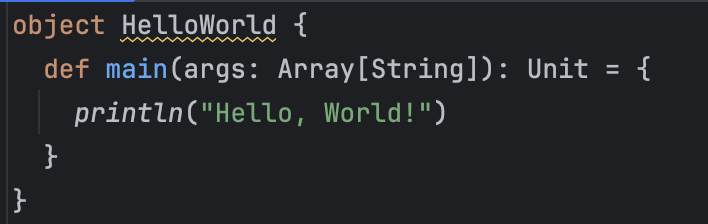
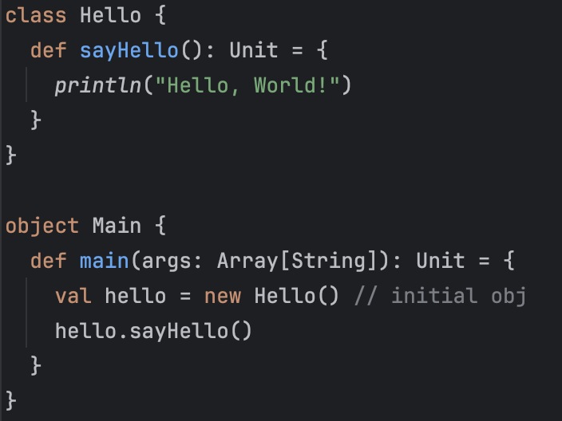
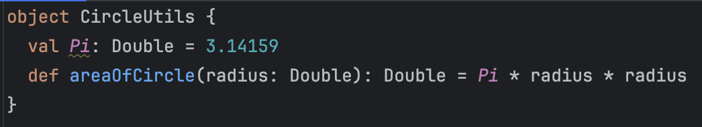
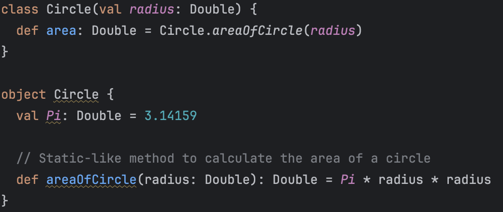
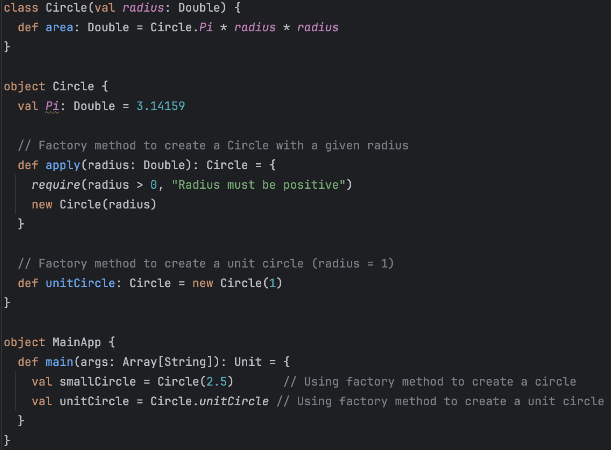

In my new role, I am diving into Scala to build robust data pipelines. Previously, my go-to programming languages were Python and Java, both of which served me well for various data-related tasks.

However, Scala offers unique advantages for building data pipelines, combining the best of functional programming and object-oriented paradigms, along with seamless integration with powerful tools like Apache Spark.

This tutorial series will begin with a comparison of Python, Java, and Scala, highlighting the distinctive features and strengths of Scala that make it an excellent choice for modern data engineering. 


## Comparison of Java, Scala, and Python

>[Scala Wiki](https://en.wikipedia.org/wiki/Scala_(programming_language))：
>Scala is quite similar to Java but offer greater flexible, making it well-suited for Big Data project.
>
>	* Scala source code can be compiled to [Java bytecode](https://en.wikipedia.org/wiki/Java_bytecode) and run on a [Java virtual machine](https://en.wikipedia.org/wiki/Java_virtual_machine) (JVM).
>	* Scala provides [language interoperability](https://en.wikipedia.org/wiki/Language_interoperability) with [Java](https://en.wikipedia.org/wiki/Java_(programming_language)) so that libraries written in either language may be referenced directly in Scala or Java code.

​    <br>

Scala has a faster execution speed than Python and is more flexible than Java, making it suitable for big data pipelines that need to be rerun daily or hourly.

| **Feature/Aspect**    | **Java**                                                     | **Scala**                                                    | **Python**                                                   |
| --------------------- | ------------------------------------------------------------ | ------------------------------------------------------------ | ------------------------------------------------------------ |
| **Language Type**     | __Compiled, statically typed__                               | __Compiled, statically typed__<br />Supports functional and object-oriented programming | __Interpreted, dynamically typed__                           |
| **Performance**       | __High performance__                                         | __High performance__ <br />Slightly slower than Java due to functional features. | __Lower performance__                                        |
| **Flexibility**       | __Low__                                                      | __Medium__                                                   | __High__                                                     |
| **Primary Use Cases** | Enterprise applications, large-scale backend services, Android development | Distributed systems, big data (e.g., Spark), applications requiring expressiveness and performance | Rapid development, data science, machine learning, scripting automation |
| **Big Data Support**  | Supports frameworks like Hadoop but requires more boilerplate code | Native support for Apache Spark with user-friendly syntax    | Via libraries like PySpark, with slightly lower performance than Java/Scala |

   <br>

**Compiled v.s. Interpreted**

| **Feature**           | **Compiled Languages**                      | **Interpreted Languages**              |
| --------------------- | ------------------------------------------- | -------------------------------------- |
| **Execution Speed**   | Fast (precompiled to machine code)          | Slow (interpreted at runtime)          |
| **Development Speed** | Slower (requires compilation)               | Faster (no compilation step)           |
| **Error Detection**   | Errors caught at compile-time               | Errors detected at runtime             |
| **Portability**       | Platform-dependent (requires recompilation) | High (interpreter handles portability) |
| **Typical Examples**  | C, C++, Java, Scala                         | Python                                 |

   <br>

**Statically Typed v.s. Dynamically Typed**

| **Feature**         | **Statically Typed**                            | **Dynamically Typed**                     |
| ------------------- | ----------------------------------------------- | ----------------------------------------- |
| **Type Checking**   | At compile-time (types fixed after declaration) | At runtime (types can change dynamically) |
| **Error Detection** | Caught during compilation                       | Caught during execution                   |
| **Performance**     | Faster runtime (no type-checking overhead)      | Slower runtime (type-checking at runtime) |
| **Examples**        | C, C++, Java, Scala                             | Python                                    |

  <br>

## Scala v.s. Java

The difference behavior on object  between Java ans Scala:

| **Feature**                | **Scala**                                                    | **Java**                                                     |
| -------------------------- | ------------------------------------------------------------ | ------------------------------------------------------------ |
| **Object-Oriented Nature** | Scala is a purely object-oriented language. This means *everything* is an object, including numbers and functions. | Java separates primitive types (e.g., `boolean`, `int`) from reference types. Functions are not objects. |
| **Static Members**         | Scala does not have `static` members. Instead, programmers use **singleton objects** (`object`) to define static-like members. | Java uses the `static` keyword to define class-level fields and methods. |
| **Type Inference**         | Scala supports **type inference**, allowing the compiler to deduce variable and return types. | Java has limited type inference (e.g., `var` since Java 10), but type declarations are often required. |
| **Trait v.s. Interface**   | Scala has **traits**, which are like interfaces but can contain method implementations. | Java has **interfaces**, which since Java 8 can have default methods, but no state. |
| **Generics**               | Scala has a powerful **generic type system**, including variance annotations (`+T`, `-T`). | Java supports generics but lacks some of Scala’s flexibility, and uses type erasure. |


### Access Modifiers Comparison

| **Modifier**         | **Scala** Description                                        | **Java** Description                                         |
| -------------------- | ------------------------------------------------------------ | ------------------------------------------------------------ |
| `public`             | Default in Scala. All members are `public` unless specified otherwise. | Must be explicitly declared. Otherwise, default is **package-private**. |
| `private`            | Accessible **only within the class** where it's defined.     | Accessible **only within the class** where it's defined.     |
| `private[this]`      | Even stricter – accessible **only within the same object instance**. | No equivalent in Java.                                       |
| `protected`          | Accessible **only in subclasses**, even outside the package. | Accessible in **subclasses and same-package classes**.       |
| `protected[package]` | Accessible within a **specific package**.                    | No equivalent in Java.                                       |
| `private[package]`   | Accessible within a **specific package**, more flexible than plain `private`. | No equivalent in Java.                                       |
| *(no modifier)*      | No keyword means `public` by default.                        | No keyword means `package-private`: accessible only within the same package. |


## Basic Scala Syntax

### Variables

| Feature                | Scala (`val` and `var`)                                   | Java (`final` and general variables)                         |
| ---------------------- | --------------------------------------------------------- | ------------------------------------------------------------ |
| **Immutable Constant** | Uses `val`, reassignment not allowed.                     | Uses `final` modifier, value cannot be changed.              |
| **Mutable Variable**   | Uses `var`, allows reassignment.                          | General variables without `final` allow reassignment.        |
| **Type Inference**     | Supports type inference, type declaration can be omitted. | Requires explicit type declaration (Java 10+ supports `var`). |

  <br>

### Flow Control

Here show how Scala to do flow control and compare the behavior with Java if need.

**For :**

```scala
for (i <- 1 to 10 if i % 2 == 0) {  // for loop with a condition
  println(i)  // Output: 2 4 6 8 10
}

for (i <- 1 to 3; j <- 1 to 2) {
  println(s"$i $j") // Output: 1 1, 1 2, 2 1, ...
}

val squares = for (i <- 1 to 5) yield i * i  // Yielding a result
println(squares)  // output: Vector(1, 4, 9, 16, 25)
```

  <br>

**IF else:**

Scala v.s. Java

* **Scala**: If-else in scala is a expression which means it can return value.

  ```scala
  val x = 10
  val result = if (x > 5) "Greater" else "Smaller"
  println(result) // Output: Greater
  ```

* **Java**: In Java  if-else is a statement, can't directly return value

  ```scala
  String result;
  
  if (x > 5) {
      result = "Greater";
  } else {
      result = "Smaller";
  }
  ```

   <br>

**While and do while**

```scala
// while
var x = 5
while (x > 0) {
  println(x)
  x -= 1
}

// do while
var y = 5
do {
  println(y)
  y -= 1
} while (y > 0)
```

  <br>

**Match and case**

```scala
val x = 10
x match {
  case i if i > 5 => println("Greater")
  case i if i > 0 => println("Smaller")
  case _ => println("Zero")
}
```


## Class and Object in Scala

A basic object in Scala:

* ```callback: () => Unit``` : Input a variable named `callback`. The `:` specifies the type of the variable, which is a function. This function is a method that takes no parameters `()` and has no return value `=> Unit`.
*  In Scala, `Unit` is similar to `void` in other programming languages.

```scala
Object SayHelloPerSec {
	def sayHelloPerSceond(callback: () => Unit) {
		while (true) { callback(); Thread sleep 1000 }
	}
	def sayHello() {
	    println("Hello world ...")
	}
	def main(args: Array[Sting]): Unit = {
		sayHelloPerSceond(sayHello)
	}
}
```

   <br>

|                       | Object                                                       | Class                                                        |
| --------------------- | ------------------------------------------------------------ | ------------------------------------------------------------ |
| **Object v.s. Class** | It is a concrete instance of a class, representing things in the real world. It is used to store data and execute methods.<br /><br />In Scala, you can directly declare an `object`. An `object` in Scala is a **singleton object**, used to represent a class with only one instance.<br /><br />In Scala main function must in Object. | Used to define the common characteristics and behaviors of objects. It is just a concept and does not exist concretely. <br /> |
| **constructer**       | Can't pass constructer parameter in object<br /><br />**object Add** | Support constructer parameter<br />**class** **Add**(a: **Double**, b: **Double**) |
| **static**            | Typically used for static function and constants. | No                                                           |
| **companion object**  | It can be used as a companion object in conjunction with a `class`, sharing the same name as the `class` and mutually accessing each other's **private members**.<br />In Scala, there is no `static` modifier like in Java. Companion objects are **the primary way to implement static methods and constants.**<br /><br />In Factory Method provides a unified interface for creating objects.<br /> | No                                                           |


### constructor

| **Feature**             | **Java**                                                     | **Scala**                                                    |
| ----------------------- | ------------------------------------------------------------ | ------------------------------------------------------------ |
| Constructor declaration | Defines constructors using methods with the same name as the class | Constructors are defined directly after the class declaration, or using `def this(...)` inside the class body |
| Primary constructor     | No explicit concept of a "primary constructor"               | Primary constructor is defined as part of the class declaration (parameters go after `class`) |
| Secondary constructor   | Uses multiple constructors with the same name for overloading | Defined using `def this(...)`; must call the primary constructor or another secondary constructor |

**Java Constructor**

```Java
public class Car {
    private int speed;
    private int length;

    public Car(int speed, int length) {
        this.speed = speed;
        this.length = length;
    }

    public Car(int speed) {
        this(speed, 0); 
    }
}

```

**Scala Constructor**

```Scala
class Car(val speed: Int, val length: Int) { 
  // main constructor clarify in class declare
  println(s"Speed: $speed, Length: $length") 

  // the secondary constructor
  def this(speed: Int) = this(speed, 0)
}

```


### **Constructor Parameters**

| Syntax                     | Accessible from outside | Usable as a field inside the class   |
| -------------------------- | ----------------------- | ------------------------------------ |
| `speed: Int`               | ❌ No                    | ✅ Yes, but not a field               |
| `val speed: Int`           | ✅ Readable              | ✅ Yes, it's a (read-only) field      |
| `var speed: Int`           | ✅ Readable & writable   | ✅ Yes, it's a mutable field          |
| `val s = speed` (in class) | ✅ Yes                   | ✅ Yes, it's a manually created field |

```
class Car(val speed: Int, length: Int) {
  def printAll(): Unit = {
    println(speed)   // ✅ OK, `speed` is a val field
    println(length)  // ✅ OK, `length` is still accessible here, but it's just a constructor parameter
  }

  def getLength(): Int = {
    // println(this.length)  // ❌ Error: there's no `length` field in the class
    length  // ✅ You can return it like this, but it's not a class member field
  }
}

```


## Anonymous function

| **Scala**                                                    | **Java**                                                     |
| ------------------------------------------------------------ | ------------------------------------------------------------ |
| Scala has concise **anonymous function** syntax: `(x: Int) => x + 1` | Java supports **lambda expressions** since Java 8: `(x) -> x + 1`. |

```() => println("Hello world ...")``` :

( ) : Indicates that the function takes no parameters (the input is empty).

`=>`: Signifies that what follows is an anonymous function (a function without a name).

```Scala
Object SayHellowPerSec {
	def sayHelloPerSceond(callback: () => Unit) {
		while (true) { callback(); Thread sleep 1000 }
	}
    def main(args: Array[Sting]): Unit = {
		sayHelloPerSceond(() =>  println("Hello world ..."))
	}
    
}
```

   <br>

## Inherent and Overwrite

Java recommended to **use the `@Override` annotation** 

```Java
class Animal {
    public void makeSound() {
        System.out.println("Some sound");
    }
}

class Dog extends Animal {
    @Override
    public void makeSound() {
        System.out.println("Woof!");
    }
}
```

Scala required to **explicitly mark overridden methods**

```Scala
class Animal {
  def makeSound(): Unit = {
    println("Some sound")
  }
}
class Dog extends Animal {
  override def makeSound(): Unit = {
    println("Woof!")
  }
}
```


## Abstract and Interface

| **Feature**                   | **Java: interface**                              | **Java: abstract class**                                | **Scala: trait**                                             | **Scala: abstract class**                               |
| ----------------------------- | ------------------------------------------------ | ------------------------------------------------------- | ------------------------------------------------------------ | ------------------------------------------------------- |
| Can implement methods         | ✅ Supports `default` methods (Java 8+)           | ✅ Can include full method implementations               | ✅ Supports method implementations                            | ✅ Can include full method implementations               |
| Can have fields               | ❌ Only allows `public static final` constants    | ✅ Can have instance fields                              | ✅ Can have `val` / `var`, but cannot pass via constructor    | ✅ Can have fields initialized via constructor           |
| Can have constructor          | ❌ Constructors are not supported                 | ✅ Constructors are allowed                              | ❌ Constructors are not supported                             | ✅ Constructors are allowed                              |
| Supports multiple inheritance | ✅ Can implement multiple interfaces              | ❌ Can inherit only one abstract class                   | ✅ Can mix in multiple traits (supports multiple inheritance) | ❌ Can inherit only one abstract class                   |
| Purpose                       | Define behavior contracts and API specifications | Create abstract base classes for shared logic and state | Define behavior and optional logic, flexibly mix into other classes | Create abstract base classes for shared logic and state |

### Abstract

**Java** :Abstract methods must be marked with the `abstract` keyword.

```Java
abstract class Animal {
    // Abstract method: no implementation
    abstract void makeSound();
}

class Dog extends Animal {
    @Override
    void makeSound() {
        System.out.println("Woof!");
    }
}
```


**Scala**: Abstract methods do not need to be marked with the `abstract` keyword; as long as the method has no implementation, it is considered abstract.

```scala
abstract class Animal {
  def makeSound(): Unit // Abstract methods，no `abstract`
}

class Dog extends Animal {
  override def makeSound(): Unit = println("Woof!")
}
```

### Interface

| **Feature**                   | **Scala**                                                    | **Java**                                                     |
| ----------------------------- | ------------------------------------------------------------ | ------------------------------------------------------------ |
| Visibility `protected`        | Accessible only by subclasses                                | Accessible by subclasses and classes in the same package     |
| Interface with implementation | Use `traits` with concrete methods                           | Use `interface` with `default` methods (since Java 8), but can't have instance fields and state variables. |
| Multiple inferitance and      | Conflicts are resolved using **linearization**, where the method in the rightmost `trait` overrides the methods from other `traits`. | Conflicts must be **explicitly resolved** in the implementing class using `super<InterfaceName>.method()` syntax if needed |


```scala
class Parent {
  def greet(): Unit = println("Hello from Parent")
}

class Child extends Parent {
  override def greet(): Unit = println("Hello from Child") // must use override
}

```

​    <br>

### Trait in Scala

**Java**：When multiple interfaces have the same `default method`, the subclass must explicitly choose which method to use; otherwise, the compilation will fail.

* Interfaces **cannot have instance fields** — they can only define constants (`static final`).
* They **cannot have state variables** — because interfaces are fundamentally designed to define **behavior**, not to **encapsulate state**.

Therefore, you **cannot define mutable fields (state)** in interfaces like `A` or `B`, which means you **cannot mix in multiple stateful traits** the way you can in Scala.

```
interface Human {
    default String greet() {
        return "Hello";
    }
    // ❌ Not allowed: int count = 1; (unless it's static final)
}

interface Soldier {
    default String battle() {
        return "Fighting！";
    }
}

class Warrior implements Human, Soldier {}

Warrior c = new Warrior();
// ✅ Can call default methods
c.greet(); // "Hello"
c.battle();  // "Fighting！"

```


**Scala**：

* Interfaces **can have instance fields** 
* They **can have state variables** 

```Scala
trait Human {
  def greet(): String = "Hello"
  var count: Int = 1  // ✅ Traits can have mutable state
}

trait Soldier {
  def battle(): String = "Fighting!"
  var strength: Int = 100  // ✅ Another mutable field
}

class Warrior extends Human with Soldier

val c = new Warrior
println(c.greet())    // "Hello"
println(c.battle())   // "Fighting!"
println(c.count)      // 1
println(c.strength)   // 100

// ✅ You can modify state variables
c.count = 2
c.strength = 80
println(c.count)      // 2
println(c.strength)   // 80

```


   <br>

### Multiple inferitance and Diamon inferientance problems

The diamond inheritance problem: D might be confused about which function to inherit when B and C have the same function.
    A
   / \
  B   C
   \ /
    D

| Feature                                  | Java                                                         | Scala                                                        |
| ---------------------------------------- | ------------------------------------------------------------ | ------------------------------------------------------------ |
| Does class support multiple inheritance? | ❌ Not supported                                              | ❌ Not supported                                              |
| Multiple inheritance via interface/trait | ✅ Supports implementing multiple interfaces (Java 8+ supports `default` methods) | ✅ Supports mixing in multiple `traits`, which can contain `val` / `var` / method implementations |
| How method conflicts are resolved        | ✅ Subclass must explicitly override and specify using `X.super.method()` | ✅ Uses *linearization* rule — the method in the rightmost trait takes precedence |

- **Scala** use Trait support multiple inferitance and **solve diamon inferientance problems**. Conflicts are resolved using **linearization**, where the method in the rightmost `trait` overrides the methods from other `traits`.

  ```scala
  trait Animal {
    def sound(): Unit // abstract method
    def action(): Unit = println("Eating...") // concrete method
  }
  
  trait Swimmer {
    def action(): Unit = println("Swimming...")
  }
  
  trait Flyer {
    def action(): Unit = println("Flying...")
  }
  
  class Duck extends Animal with Swimmer with Flyer {
    // implement abstract method
    override def sound(): Unit = println("Quack Quack")
  }
  
  object Main extends App {
    val duck = new Duck()
    duck.sound() // Quack Quack
    duck.action() // Flying...
  }
  ```

* Java:

```Java
interface Animal {
    void sound(); // abstract method

    default void action() {
        System.out.println("Eating...");
    }
}

interface Swimmer {
    default void action() {
        System.out.println("Swimming...");
    }
}

interface Flyer {
    default void action() {
        System.out.println("Flying...");
    }
}

class Duck implements Animal, Swimmer, Flyer {

    @Override
    public void sound() {
        System.out.println("Quack Quack");
    }

    // Manully solve default method conflict
    @Override
    public void action() {
        // Explicity specify which interface's default to use
        Flyer.super.action();
    }
}

public class Main {
    public static void main(String[] args) {
        Duck duck = new Duck();
        duck.sound();  // Quack Quack
        duck.action(); // Flying...
    }
}

```

 <br>

## Generics

|       | Description                                                  |
| ----- | ------------------------------------------------------------ |
| Java  | * Java programmers adopt `Object` as the superclass of all objects. <br /><br />* This approach is limited: it doesn't support primitive types and requires manual type casting. |
| Scala | * Scala addresses this issue by allowing the definition of generic classes (and functions). |

​     <br>

Here is an example of generic:

* `Box[T]`: The use of `T` indicates that the class is generic.
* `private var contents: T = _`: The initial value of this variable is `_`, which represents the default value for the type `T`. For numeric types, the default value is `0`; for `Boolean`, it is `false`; for `Unit`, it is `()`; and for all object types, it is `null`.
* `val intBox = new Box[Int]()` : When initializing a `Box`, you must specify the type parameter `T`.

```Scala
class Box[T](private var content: Option[T] = None) {
  private var contents: T = _
  def getContent: T = contents
  def setContent(value: T): Unit = {contents = value}
}

object GenericExample {
  def main(args: Array[String]): Unit = {
    // Create an uninitialized Box of Int
    val intBox = new Box[Int]()
    intBox.setContent(42)
    println(s"Integer Box contains: ${intBox.getContent}")

    // Create an uninitialized Box of String
    val stringBox = new Box[String]()
    stringBox.setContent("Scala Generics")
    println(s"String Box contains: ${stringBox.getContent}")

    // Create an uninitialized Box of List
    val listBox = new Box[List[Int]]()
    listBox.setContent(List(1, 2, 3, 4))
    println(s"List Box contains: ${listBox.getContent}")
  }
}
```

Output:

```
Integer Box contains: 42
String Box contains: Scala Generics
List Box contains: List(1, 2, 3, 4)
```


