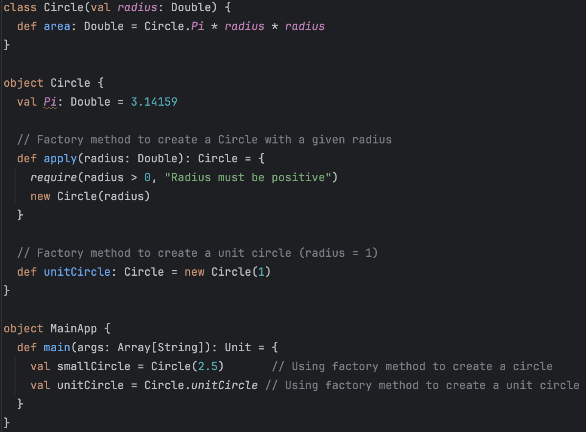

In my new role, I am diving into Scala to build robust data pipelines. Previously, my go-to programming languages were Python and Java, both of which served me well for various data-related tasks.

However, Scala offers unique advantages for building data pipelines, combining the best of functional programming and object-oriented paradigms, along with seamless integration with powerful tools like Apache Spark.

This tutorial series will begin with a comparison of Python, Java, and Scala, highlighting the distinctive features and strengths of Scala that make it an excellent choice for modern data engineering. 

Next I will Introduct the basic of Scala, and if need I will compare rhe difference java and Scala:

* Variables
* Flow Control
* Class and Object
* Interface and Inherent
* Multiple Inheritance - Trait in Scala
* Generics

# Comparison of Java, Scala, and Python

>[Scala Wiki](https://en.wikipedia.org/wiki/Scala_(programming_language))：
>Scala is quite similar to Java but offer greater flexible, making it well-suited for Big Data project.
>
>	* Scala source code can be compiled to [Java bytecode](https://en.wikipedia.org/wiki/Java_bytecode) and run on a [Java virtual machine](https://en.wikipedia.org/wiki/Java_virtual_machine) (JVM).
>	* Scala provides [language interoperability](https://en.wikipedia.org/wiki/Language_interoperability) with [Java](https://en.wikipedia.org/wiki/Java_(programming_language)) so that libraries written in either language may be referenced directly in Scala or Java code.

​    <br>

Scala has a faster execution speed than Python and is more flexible than Java, making it suitable for big data pipelines that need to be rerun daily or hourly.

| **Feature/Aspect**    | **Java**                                                     | **Scala**                                                    | **Python**                                                   |
| --------------------- | ------------------------------------------------------------ | ------------------------------------------------------------ | ------------------------------------------------------------ |
| **Language Type**     | __Compiled, statically typed__                               | __Compiled, statically typed__<br />Supports functional and object-oriented programming | __Interpreted, dynamically typed__                           |
| **Performance**       | __High performance__                                         | __High performance__ <br />Slightly slower than Java due to functional features. | __Lower performance__                                        |
| **Flexibility**       | __Low__                                                      | __Medium__                                                   | __High__                                                     |
| **Primary Use Cases** | Enterprise applications, large-scale backend services, Android development | Distributed systems, big data (e.g., Spark), applications requiring expressiveness and performance | Rapid development, data science, machine learning, scripting automation |
| **Big Data Support**  | Supports frameworks like Hadoop but requires more boilerplate code | Native support for Apache Spark with user-friendly syntax    | Via libraries like PySpark, with slightly lower performance than Java/Scala |

   <br>

**Compiled v.s. Interpreted**

| **Feature**           | **Compiled Languages**                      | **Interpreted Languages**              |
| --------------------- | ------------------------------------------- | -------------------------------------- |
| **Execution Speed**   | Fast (precompiled to machine code)          | Slow (interpreted at runtime)          |
| **Development Speed** | Slower (requires compilation)               | Faster (no compilation step)           |
| **Error Detection**   | Errors caught at compile-time               | Errors detected at runtime             |
| **Portability**       | Platform-dependent (requires recompilation) | High (interpreter handles portability) |
| **Typical Examples**  | C, C++, Java, Scala                         | Python                                 |

   <br>

**Statically Typed v.s. Dynamically Typed**

| **Feature**         | **Statically Typed**                            | **Dynamically Typed**                     |
| ------------------- | ----------------------------------------------- | ----------------------------------------- |
| **Type Checking**   | At compile-time (types fixed after declaration) | At runtime (types can change dynamically) |
| **Error Detection** | Caught during compilation                       | Caught during execution                   |
| **Performance**     | Faster runtime (no type-checking overhead)      | Slower runtime (type-checking at runtime) |
| **Examples**        | C, C++, Java, Scala                             | Python                                    |

  <br>

## Variables

| Feature                | Scala (`val` and `var`)                                   | Java (`final` and general variables)                         |
| ---------------------- | --------------------------------------------------------- | ------------------------------------------------------------ |
| **Immutable Constant** | Uses `val`, reassignment not allowed.                     | Uses `final` modifier, value cannot be changed.              |
| **Mutable Variable**   | Uses `var`, allows reassignment.                          | General variables without `final` allow reassignment.        |
| **Type Inference**     | Supports type inference, type declaration can be omitted. | Requires explicit type declaration (Java 10+ supports `var`). |

  <br>

## Flow Control

Here show how Scala to do flow control and compare the behavior with Java if need.

**For :**

```scala
for (i <- 1 to 10 if i % 2 == 0) {  // for loop with a condition
  println(i)  // Output: 2 4 6 8 10
}

for (i <- 1 to 3; j <- 1 to 2) {
  println(s"$i $j") // Output: 1 1, 1 2, 2 1, ...
}

val squares = for (i <- 1 to 5) yield i * i  // Yielding a result
println(squares)  // output: Vector(1, 4, 9, 16, 25)
```

  <br>

**IF else:**

Scala v.s. Java

* **Scala**: If-else in scala is a expression which means it can return value.

  ```scala
  val x = 10
  val result = if (x > 5) "Greater" else "Smaller"
  println(result) // Output: Greater
  ```

* **Java**: In Java  if-else is a statement, can't directly return value

  ```scala
  String result;
  
  if (x > 5) {
      result = "Greater";
  } else {
      result = "Smaller";
  }
  ```

   <br>

**While and do while**

```scala
// while
var x = 5
while (x > 0) {
  println(x)
  x -= 1
}

// do while
var y = 5
do {
  println(y)
  y -= 1
} while (y > 0)
```

  <br>

**Match and case**

```scala
val x = 10
x match {
  case i if i > 5 => println("Greater")
  case i if i > 0 => println("Smaller")
  case _ => println("Zero")
}
```

# Class and Object

## Scala v.s. Java in Object and Class

The difference behavior on object  between Java ans Scala:

| **Feature**                      | **Scala**                                                    | **Java**                                                     |
| -------------------------------- | ------------------------------------------------------------ | ------------------------------------------------------------ |
| **Static Members**               | **Scala does not have static members**(functions or fields). <br />Instead, programmers declare these members in singleton objects. | Java defines static members for basic types and fields using the `static` keyword. |
| **Primitive vs Reference Types** | Scala treats everything as objects, including numbers and functions. | Java separates primitive types (e.g., `boolean`, `int`) from reference types and cannot treat functions as variables. |
| **Object-Oriented Nature**       | Scala is a purely object-oriented language. This means *everything* is an object, including numbers and functions. | Java is object-oriented but has primitive types and does not treat them as objects. |

  <br>

## Class v.s. Object

A basic object in Scala:

* ```callback: () => Unit``` : Input a variable named `callback`. The `:` specifies the type of the variable, which is a function. This function is a method that takes no parameters `()` and has no return value `=> Unit`.
*  In Scala, `Unit` is similar to `void` in other programming languages.

```scala
Object SayHelloPerSec {
	def sayHelloPerSceond(callback: () => Unit) {
		while (true) { callback(); Thread sleep 1000 }
	}
	def sayHello() {
	    println("Hello world ...")
	}
	def main(args: Array[Sting]): Unit = {
		sayHelloPerSceond(sayHello)
	}
}
```

   <br>

|                       | Object                                                       | Class                                                        |
| --------------------- | ------------------------------------------------------------ | ------------------------------------------------------------ |
| **Object v.s. Class** | It is a concrete instance of a class, representing things in the real world. It is used to store data and execute methods.<br /><br />In Scala, you can directly declare an `object`. An `object` in Scala is a **singleton object**, used to represent a class with only one instance.<br /> | Used to define the common characteristics and behaviors of objects. It is just a concept and does not exist concretely. <br /> |
| **constructer**       | Can't pass constructer parameter in object<br /><br />**object Add** | Support constructer parameter<br />**class** **Add**(a: **Double**, b: **Double**) |
| **static**            | Typically used for static function and constants. | No                                                           |
| **companion object**  | It can be used as a companion object in conjunction with a `class`, sharing the same name as the `class` and mutually accessing each other's **private members**.<br />In Scala, there is no `static` modifier like in Java. Companion objects are **the primary way to implement static methods and constants.**<br /><br />In Factory Method provides a unified interface for creating objects.<br /> | No                                                           |


   <br>

## Object

### Anonymous function

```() => println("Hello world ...")``` :

( ) : Indicates that the function takes no parameters (the input is empty).

`=>`: Signifies that what follows is an anonymous function (a function without a name).

```Scala
Object SayHellowPerSec {
	def sayHelloPerSceond(callback: () => Unit) {
		while (true) { callback(); Thread sleep 1000 }
	}
    def main(args: Array[Sting]): Unit = {
		sayHelloPerSceond(() =>  println("Hello world ..."))
	}
    
}
```

   <br>

## Interface and Inherent

## Inherient

```scala
class Parent {
  def greet(): Unit = println("Hello from Parent")
}

class Child extends Parent {
  override def greet(): Unit = println("Hello from Child") // must use override
}

```

​    <br>

## Abstract

**Java** :Abstract methods must be marked with the `abstract` keyword.

**Scala**: Abstract methods do not need to be marked with the `abstract` keyword; as long as the method has no implementation, it is considered abstract.

```scala
abstract class Animal {
  def makeSound(): Unit // Abstract methods，no `abstract`
}

class Dog extends Animal {
  override def makeSound(): Unit = println("Woof!")
}
```

​    <br>

## Multiple Inheritance

**Java**：When multiple interfaces have the same `default method`, the subclass must explicitly choose which method to use; otherwise, the compilation will fail.

**Scala**：Conflicts are resolved using **linearization**, where the method in the rightmost `trait` overrides the methods from other `traits`.

| Feature                | Scala                                                        | Java                                                         |
| ---------------------- | ------------------------------------------------------------ | ------------------------------------------------------------ |
| Multiple Inheritance   | Supports multiple `traits`                                   | Interfaces support multiple inheritance (Java 8+ supports `default` methods) |
| Visibility `protected` | Accessible only by subclasses                                | Accessible by subclasses and classes in the same package     |
| `trait` Support        | Supports concrete methods and variables, allows multiple stacking | Does not support variables, only supports `default` methods (Java 8+) |

​    <br>

### Scala Trait

- **Scala** use Trait support multiple inferitance and **solve diamon inferientance problems**

  An example:

  ```scala
  trait Animal {
    def sound(): Unit // abstract method
    def eat(): Unit = println("Eating...") // concrete method
  }
  
  trait Swimmer {
    def swim(): Unit = println("Swimming...")
  }
  
  trait Flyer {
    def fly(): Unit = println("Flying...")
  }
  
  class Duck extends Animal with Swimmer with Flyer {
    // implement abstract method
    override def sound(): Unit = println("Quack Quack")
  }
  
  object Main extends App {
    val duck = new Duck()
    duck.sound() // Quack Quack
    duck.swim() // Swimming...
    duck.fly() // Flying...
  }
  ```

- Scala uses the concept of **linearization (Last First)** to resolve conflicts. Even with multiple `traits`, Scala will flatten them into a single, unique inheritance hierarchy.

  ```scala
  The diamond inheritance problem: D might be confused about which function to inherit when B and C have the same function.
      A
     / \
    B   C
     \ /
      D
  
  trait Animal {
    def sound(): Unit // abstract method
    def eat(): Unit = println("Eating...") // concrete method
  }
  
  trait Swimmer extends Animal {
    override def eat(): Unit = println("Eating while swimming...")
    def swim(): Unit = println("Swimming...")
  }
  
  trait Flyer extends Animal {
    override def eat(): Unit = println("Eating while flying...")
    def fly(): Unit = println("Flying...")
  }
  
  class Duck extends Swimmer with Flyer {
    // implement abstract method
    override def sound(): Unit = println("Quack Quack")
  }
  
  object Main extends App {
    val duck = new Duck()
    duck.sound() // Quack Quack
    duck.eat()   // Eating while flying... (Last first)
    duck.swim()  // Swimming...
    duck.fly()   // Flying...
  }
  
  ```

​     <br>

## Generics

|       | Description                                                  |
| ----- | ------------------------------------------------------------ |
| Java  | * Java programmers adopt `Object` as the superclass of all objects. <br /><br />* This approach is limited: it doesn't support primitive types and requires manual type casting. |
| Scala | * Scala addresses this issue by allowing the definition of generic classes (and functions). |

​     <br>

Here is an example of generic:

* `Box[T]`: The use of `T` indicates that the class is generic.
* `private var contents: T = _`: The initial value of this variable is `_`, which represents the default value for the type `T`. For numeric types, the default value is `0`; for `Boolean`, it is `false`; for `Unit`, it is `()`; and for all object types, it is `null`.
* `val intBox = new Box[Int]()` : When initializing a `Box`, you must specify the type parameter `T`.

```Scala
class Box[T](private var content: Option[T] = None) {
  private var contents: T = _
  def getContent: T = contents
  def setContent(value: T): Unit = {contents = value}
}

object GenericExample {
  def main(args: Array[String]): Unit = {
    // Create an uninitialized Box of Int
    val intBox = new Box[Int]()
    intBox.setContent(42)
    println(s"Integer Box contains: ${intBox.getContent}")

    // Create an uninitialized Box of String
    val stringBox = new Box[String]()
    stringBox.setContent("Scala Generics")
    println(s"String Box contains: ${stringBox.getContent}")

    // Create an uninitialized Box of List
    val listBox = new Box[List[Int]]()
    listBox.setContent(List(1, 2, 3, 4))
    println(s"List Box contains: ${listBox.getContent}")
  }
}
```

Output:

```
Integer Box contains: 42
String Box contains: Scala Generics
List Box contains: List(1, 2, 3, 4)
```


